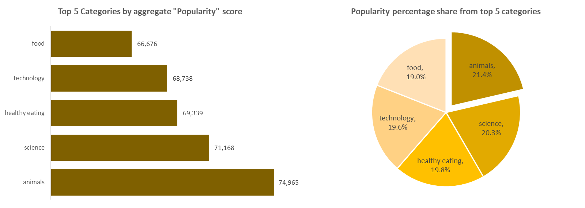

<h1>Data Analytics & Visualization Virtual Internship</h1>
<h2>Introduction</h2>
 
<b>Social Buzz</b> is a social media company in San Francisco where content takes center stage. Unlike other companies that use traditional likes/dislikes to measure engagement, Social Buzz gives users over 100 ways to react to content. 

Over the last 5 years, Social Buzz has grown enormously, reaching over 500 million active monthly users with over 100K content posted daily. 

Social Buzz has reached out to Accenture as they plan to IPO within a year, and they need expertise in analyzing the massive unstructured data they produce daily from users.

As an Analyst at Accenture, we're tasked with cleaning and analyzing data from 3 datasets - Content, Reactions, and ReactionTypes and highlighting the top 5 categories with the largest aggregate popularity.
 

<h2>Key Metrics</h2>
 <dl>
  <dt>Content Category</dt>
  <dd>- A string detailing the category that content is relevant to</dd>
  <dt>Score</dt>
  <dd>- This is the number calculated by Social Buzz that quantifies how "popular" each reaction is. A reaction type with a higher score should be considered as a more popular reaction</dd>
</dl>

<h2>Summary of Insights</h2>
<figure>
   
</figure>

 
Animals and Science comprise over 40% of the most popular content categories. This shows that people enjoy real-life and factual content the most.
 

<h2>Recommendations & Next Steps</h2>

Food is a common theme in the top 5 categories with "Healthy Eating" ranking the highest. This shows the type of users of Social Buzz. This insight can be used to create a marketing campaign and work with healthy eating brands to boost user engagement. 

This one-off analysis is insightful, but more time is needed to understand better the data and predict trends.

The marketing team should create more campaigns for content in the top 5 categories. This will increase user interactions.

 
